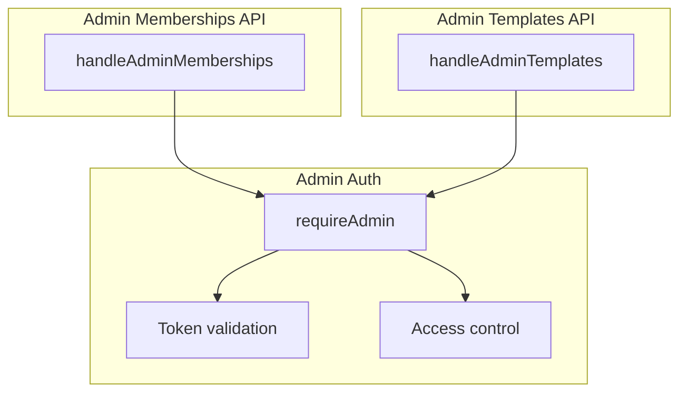

```mermaid
%% Diagram: Admin Authentication
graph TD
  subgraph src/lib/auth/admin.ts [Admin Auth]
    RequireAdmin[requireAdmin] --> TokenValidation[Token validation]
    RequireAdmin --> AccessControl[Access control]
  end
  subgraph src/api/admin/memberships.ts [Admin Memberships API]
    AdminMemberships[handleAdminMemberships] --> RequireAdmin
  end
  subgraph src/api/admin/templates.ts [Admin Templates API]
    AdminTemplates[handleAdminTemplates] --> RequireAdmin
  end
```
