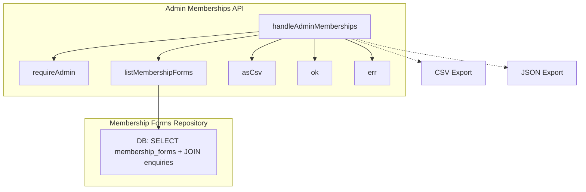

```mermaid
%% Diagram: Admin Memberships Flow
graph TD
  subgraph src/api/admin/memberships.ts [Admin Memberships API]
    AdminMemberships[handleAdminMemberships]
    AdminMemberships --> RequireAdmin[requireAdmin]
    AdminMemberships --> ListMembershipForms[listMembershipForms]
    AdminMemberships --> AsCsv[asCsv]
    AdminMemberships --> Ok[ok]
    AdminMemberships --> Err[err]
  end
  subgraph src/lib/repositories/membership-forms.ts [Membership Forms Repository]
    ListMembershipForms --> MembershipDB[DB: SELECT membership_forms + JOIN enquiries]
  end
  AdminMemberships -.-> CSVExport[CSV Export]
  AdminMemberships -.-> JSONExport[JSON Export]
```
