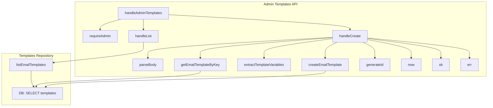

```mermaid
%% Diagram: Admin Templates Flow
graph TD
  subgraph src/api/admin/templates.ts [Admin Templates API]
    AdminTemplates[handleAdminTemplates]
    AdminTemplates --> RequireAdmin[requireAdmin]
    AdminTemplates --> HandleList[handleList]
    AdminTemplates --> HandleCreate[handleCreate]
    HandleCreate --> ParseBody[parseBody]
    HandleCreate --> GetEmailTemplateByKey[getEmailTemplateByKey]
    HandleCreate --> ExtractVars[extractTemplateVariables]
    HandleCreate --> CreateEmailTemplate[createEmailTemplate]
    HandleCreate --> GenerateId[generateId]
    HandleCreate --> Now[now]
    HandleCreate --> Ok[ok]
    HandleCreate --> Err[err]
  end
  subgraph src/lib/repositories/templates.ts [Templates Repository]
    CreateEmailTemplate --> TemplateDB[DB: INSERT templates]
    ListEmailTemplates --> TemplateDB[DB: SELECT templates]
    GetEmailTemplateByKey --> TemplateDB[DB: SELECT templates]
  end
  HandleList --> ListEmailTemplates[listEmailTemplates]
```
