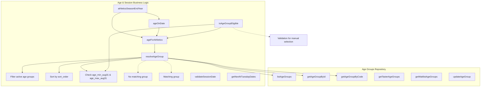

```mermaid
%% Diagram: Age Group Logic (Granular)
graph TD
  subgraph src/lib/business/age.ts [Age & Session Business Logic]
    AthleticsSeasonEndYear[athleticsSeasonEndYear] --> AgeOnDate[ageOnDate]
    AthleticsSeasonEndYear --> AgeForAthletics[ageForAthletics]
    AgeOnDate --> AgeForAthletics
    AgeForAthletics --> ResolveAgeGroup[resolveAgeGroup]
    ResolveAgeGroup --> ActiveFilter[Filter active age groups]
    ResolveAgeGroup --> SortOrder[Sort by sort_order]
    ResolveAgeGroup --> AgeMinMaxCheck[Check age_min_aug31 & age_max_aug31]
    ResolveAgeGroup -.-> NoMatch[No matching group]
    ResolveAgeGroup -.-> Match[Matching group]
    IsAgeGroupEligible[isAgeGroupEligible] --> AgeForAthletics
    IsAgeGroupEligible --> AgeMinMaxCheck
    ValidateSessionDate[validateSessionDate]
    GetNextNTuesdayDates[getNextNTuesdayDates]
  end
  subgraph src/lib/repositories/age-groups.ts [Age Groups Repository]
    ListAgeGroups[listAgeGroups]
    GetAgeGroupById[getAgeGroupById]
    GetAgeGroupByCode[getAgeGroupByCode]
    GetTasterAgeGroups[getTasterAgeGroups]
    GetWaitlistAgeGroups[getWaitlistAgeGroups]
    UpdateAgeGroup[updateAgeGroup]
  end
  ResolveAgeGroup --> ListAgeGroups
  ResolveAgeGroup --> GetAgeGroupById
  ResolveAgeGroup --> GetAgeGroupByCode
  IsAgeGroupEligible -.-> ValidationFlow[Validation for manual selection]
```
