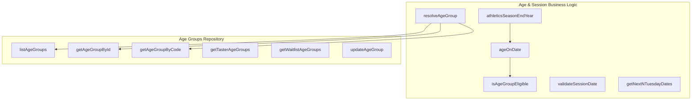

```mermaid
%% Diagram: Age Group Logic
graph TD
  subgraph src/lib/business/age.ts [Age & Session Business Logic]
    AthleticsSeasonEndYear[athleticsSeasonEndYear] --> AgeOnDate[ageOnDate]
    AgeOnDate --> IsAgeGroupEligible[isAgeGroupEligible]
    ValidateSessionDate[validateSessionDate]
    GetNextNTuesdayDates[getNextNTuesdayDates]
    ResolveAgeGroup[resolveAgeGroup]
  end
  subgraph src/lib/repositories/age-groups.ts [Age Groups Repository]
    ListAgeGroups[listAgeGroups]
    GetAgeGroupById[getAgeGroupById]
    GetAgeGroupByCode[getAgeGroupByCode]
    GetTasterAgeGroups[getTasterAgeGroups]
    GetWaitlistAgeGroups[getWaitlistAgeGroups]
    UpdateAgeGroup[updateAgeGroup]
  end
  ResolveAgeGroup --> ListAgeGroups
  ResolveAgeGroup --> GetAgeGroupById
  ResolveAgeGroup --> GetAgeGroupByCode
```
