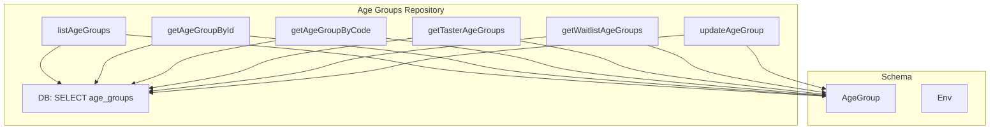

```mermaid
%% Diagram: Age Groups Repository
graph TD
  subgraph src/lib/repositories/age-groups.ts [Age Groups Repository]
    ListAgeGroups[listAgeGroups] --> AgeGroupDB[DB: SELECT age_groups]
    GetAgeGroupById[getAgeGroupById] --> AgeGroupDB
    GetAgeGroupByCode[getAgeGroupByCode] --> AgeGroupDB
    GetTasterAgeGroups[getTasterAgeGroups] --> AgeGroupDB
    GetWaitlistAgeGroups[getWaitlistAgeGroups] --> AgeGroupDB
    UpdateAgeGroup[updateAgeGroup] --> AgeGroupDB
  end
  subgraph src/lib/db/schema.ts [Schema]
    AgeGroup[AgeGroup]
    Env[Env]
  end
  ListAgeGroups --> AgeGroup
  GetAgeGroupById --> AgeGroup
  GetAgeGroupByCode --> AgeGroup
  GetTasterAgeGroups --> AgeGroup
  GetWaitlistAgeGroups --> AgeGroup
  UpdateAgeGroup --> AgeGroup
```
