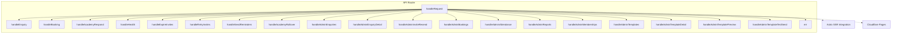

```mermaid
%% Diagram: API Routing and Entry Points
graph TD
  subgraph src/api/router.ts [API Router]
    Router[handleRequest]
    Router --> Enquiry[handleEnquiry]
    Router --> Booking[handleBooking]
    Router --> AcademyRespond[handleAcademyRespond]
    Router --> Health[handleHealth]
    Router --> ExpireInvites[handleExpireInvites]
    Router --> RetryInvites[handleRetryInvites]
    Router --> SendReminders[handleSendReminders]
    Router --> AcademyRollover[handleAcademyRollover]
    Router --> AdminEnquiries[handleAdminEnquiries]
    Router --> AdminEnquiryDetail[handleAdminEnquiryDetail]
    Router --> AdminInviteResend[handleAdminInviteResend]
    Router --> AdminBookings[handleAdminBookings]
    Router --> AdminAttendance[handleAdminAttendance]
    Router --> AdminReports[handleAdminReports]
    Router --> AdminMemberships[handleAdminMemberships]
    Router --> AdminTemplates[handleAdminTemplates]
    Router --> AdminTemplateDetail[handleAdminTemplateDetail]
    Router --> AdminTemplatePreview[handleAdminTemplatePreview]
    Router --> AdminTemplateTestSend[handleAdminTemplateTestSend]
    Router --> Err[err]
  end
  Router -.-> AstroSSR[Astro SSR Integration]
  Router -.-> CloudflarePages[Cloudflare Pages]
```
