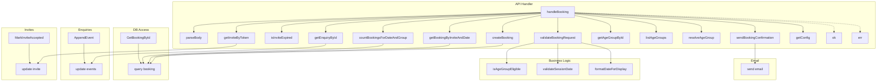

```mermaid
%% Diagram: Booking Workflow
graph TD
  subgraph src/api/booking.ts [API Handler]
    BookingHandler[handleBooking]
    BookingHandler --> ParseBody[parseBody]
    BookingHandler --> GetInvite[getInviteByToken]
    BookingHandler --> IsInviteExpired[isInviteExpired]
    BookingHandler --> GetEnquiry[getEnquiryById]
    BookingHandler --> ValidateBooking[validateBookingRequest]
    BookingHandler --> CreateBooking[createBooking]
    BookingHandler --> CountBookings[countBookingsForDateAndGroup]
    BookingHandler --> GetBookingByInvite[getBookingByInviteAndDate]
    BookingHandler --> GetAgeGroup[getAgeGroupById]
    BookingHandler --> ListAgeGroups[listAgeGroups]
    BookingHandler --> ResolveAgeGroup[resolveAgeGroup]
    BookingHandler --> SendConfirmation[sendBookingConfirmation]
    BookingHandler --> GetConfig[getConfig]
    BookingHandler -.-> Ok[ok]
    BookingHandler -.-> Err[err]
  end
  subgraph src/lib/business/booking.ts [Business Logic]
    ValidateBooking --> AgeGroupEligible[isAgeGroupEligible]
    ValidateBooking --> ValidateSessionDate[validateSessionDate]
    ValidateBooking --> FormatDate[formatDateForDisplay]
  end
  subgraph src/lib/repositories/bookings.ts [DB Access]
    CreateBooking --> BookingDB[insert booking]
    GetBookingByInvite --> BookingDB[query booking]
    CountBookings --> BookingDB[query count]
    GetBookingById --> BookingDB[query booking]
  end
  subgraph src/lib/repositories/enquiries.ts [Enquiries]
    GetEnquiry --> EnquiryDB[query enquiry]
    AppendEvent --> EnquiryDB[update events]
  end
  subgraph src/lib/repositories/invites.ts [Invites]
    GetInvite --> InviteDB[query invite]
    MarkInviteAccepted --> InviteDB[update invite]
  end
  subgraph src/lib/email/templates.ts [Email]
    SendConfirmation --> EmailSend[send email]
  end
```
