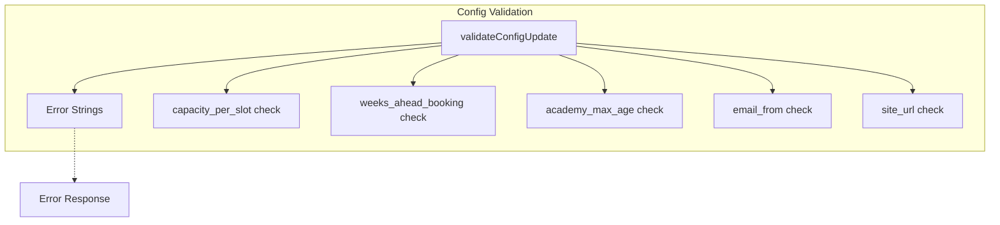

```mermaid
%% Diagram: Config Validation
graph TD
  subgraph src/lib/config.ts [Config Validation]
    ValidateConfigUpdate[validateConfigUpdate] --> ErrorArray[Error Strings]
    ValidateConfigUpdate --> CapacityCheck[capacity_per_slot check]
    ValidateConfigUpdate --> WeeksAheadCheck[weeks_ahead_booking check]
    ValidateConfigUpdate --> AcademyAgeCheck[academy_max_age check]
    ValidateConfigUpdate --> EmailFromCheck[email_from check]
    ValidateConfigUpdate --> SiteUrlCheck[site_url check]
  end
  ErrorArray -.-> ErrorFlow[Error Response]
```
