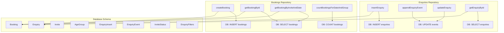

```mermaid
%% Diagram: Data Repositories & Schema
graph TD
  subgraph src/lib/repositories/enquiries.ts [Enquiries Repository]
    InsertEnquiry[insertEnquiry] --> DBInsert[DB: INSERT enquiries]
    AppendEnquiryEvent[appendEnquiryEvent] --> DBUpdate[DB: UPDATE events]
    UpdateEnquiry[updateEnquiry] --> DBUpdate
    GetEnquiryById[getEnquiryById] --> DBSelect[DB: SELECT enquiries]
  end
  subgraph src/lib/repositories/bookings.ts [Bookings Repository]
    CreateBooking[createBooking] --> DBInsertBooking[DB: INSERT bookings]
    GetBookingById[getBookingById] --> DBSelectBooking[DB: SELECT bookings]
    GetBookingByInviteAndDate[getBookingByInviteAndDate] --> DBSelectBooking
    CountBookingsForDateAndGroup[countBookingsForDateAndGroup] --> DBCount[DB: COUNT bookings]
  end
  subgraph src/lib/db/schema.ts [Database Schema]
    Enquiry[Enquiry]
    Booking[Booking]
    Invite[Invite]
    AgeGroup[AgeGroup]
    EnquiryInsert[EnquiryInsert]
    EnquiryEvent[EnquiryEvent]
    InviteStatus[InviteStatus]
    EnquiryFilters[EnquiryFilters]
  end
  InsertEnquiry --> Enquiry
  CreateBooking --> Booking
  GetEnquiryById --> Enquiry
  GetBookingById --> Booking
  GetBookingByInviteAndDate --> Booking
```
