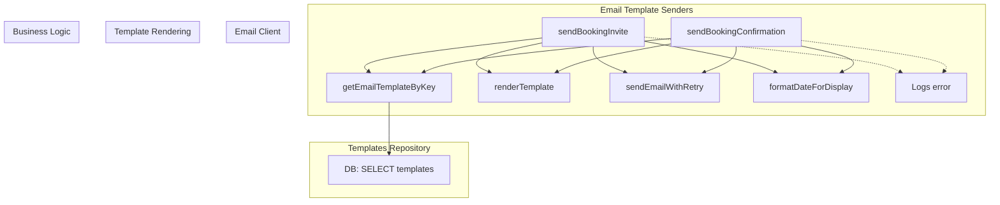

```mermaid
%% Diagram: Email Template Senders
graph TD
  subgraph src/lib/email/templates.ts [Email Template Senders]
    SendBookingInvite[sendBookingInvite] --> GetTemplate[getEmailTemplateByKey]
    SendBookingInvite --> RenderTemplate[renderTemplate]
    SendBookingInvite --> SendEmail[sendEmailWithRetry]
    SendBookingInvite --> FormatDate[formatDateForDisplay]
    SendBookingInvite -.-> ErrorLog[Logs error]
    SendBookingConfirmation[sendBookingConfirmation] --> GetTemplate
    SendBookingConfirmation --> RenderTemplate
    SendBookingConfirmation --> SendEmail
    SendBookingConfirmation --> FormatDate
    SendBookingConfirmation -.-> ErrorLog
  end
  subgraph src/lib/repositories/templates.ts [Templates Repository]
    GetTemplate --> TemplateDB[DB: SELECT templates]
  end
  subgraph src/lib/email/client.ts [Email Client]
    SendEmail[sendEmailWithRetry]
  end
  subgraph src/lib/business/templates.ts [Template Rendering]
    RenderTemplate[renderTemplate]
  end
  subgraph src/lib/business/age.ts [Business Logic]
    FormatDate[formatDateForDisplay]
  end
```
