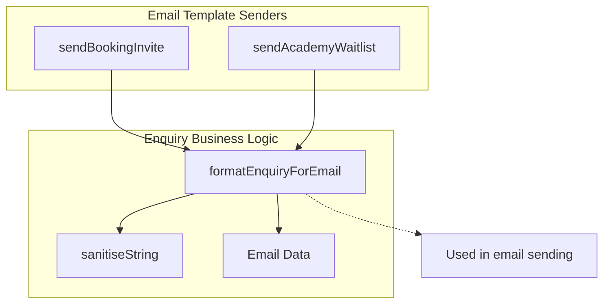

```mermaid
%% Diagram: Enquiry Data Formatting for Email
graph TD
  subgraph src/lib/business/enquiry.ts [Enquiry Business Logic]
    FormatEnquiryForEmail[formatEnquiryForEmail] --> SanitiseString[sanitiseString]
    FormatEnquiryForEmail --> EmailData[Email Data]
  end
  subgraph src/lib/email/templates.ts [Email Template Senders]
    SendBookingInvite[sendBookingInvite] --> FormatEnquiryForEmail
    SendAcademyWaitlist[sendAcademyWaitlist] --> FormatEnquiryForEmail
  end
  FormatEnquiryForEmail -.-> EmailSend[Used in email sending]
```
