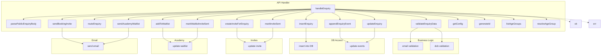

```mermaid
%% Diagram: Enquiry Workflow
graph TD
  subgraph src/api/enquiry.ts [API Handler]
    EnquiryHandler[handleEnquiry]
    EnquiryHandler --> ParseBody[parsePublicEnquiryBody]
    EnquiryHandler --> Validate[validateEnquiryData]
    EnquiryHandler --> RouteEnquiry[routeEnquiry]
    EnquiryHandler --> InsertEnquiry[insertEnquiry]
    EnquiryHandler --> AppendEvent[appendEnquiryEvent]
    EnquiryHandler --> UpdateEnquiry[updateEnquiry]
    EnquiryHandler --> CreateInvite[createInviteForEnquiry]
    EnquiryHandler --> MarkInviteSent[markInviteSent]
    EnquiryHandler --> AddToWaitlist[addToWaitlist]
    EnquiryHandler --> MarkWaitlistInviteSent[markWaitlistInviteSent]
    EnquiryHandler --> SendBookingInvite[sendBookingInvite]
    EnquiryHandler --> SendWaitlistEmail[sendAcademyWaitlist]
    EnquiryHandler --> GetConfig[getConfig]
    EnquiryHandler --> GenerateId[generateId]
    EnquiryHandler --> ListAgeGroups[listAgeGroups]
    EnquiryHandler --> ResolveAgeGroup[resolveAgeGroup]
  end
  subgraph src/lib/business/enquiry.ts [Business Logic]
    Validate --> EmailRegex[email validation]
    Validate --> DOBCheck[dob validation]
  end
  subgraph src/lib/repositories/enquiries.ts [DB Access]
    InsertEnquiry --> DBInsert[insert into DB]
    AppendEvent --> DBUpdate[update events]
    UpdateEnquiry --> DBUpdate
  end
  subgraph src/lib/repositories/invites.ts [Invites]
    CreateInvite --> InviteDB[insert invite]
    MarkInviteSent --> InviteDB[update invite]
  end
  subgraph src/lib/repositories/academy.ts [Academy]
    AddToWaitlist --> AcademyDB[insert waitlist]
    MarkWaitlistInviteSent --> AcademyDB[update waitlist]
  end
  subgraph src/lib/email/templates.ts [Email]
    SendBookingInvite --> EmailSend[send email]
    SendWaitlistEmail --> EmailSend
  end
  EnquiryHandler -.-> Ok[ok]
  EnquiryHandler -.-> Err[err]
```
