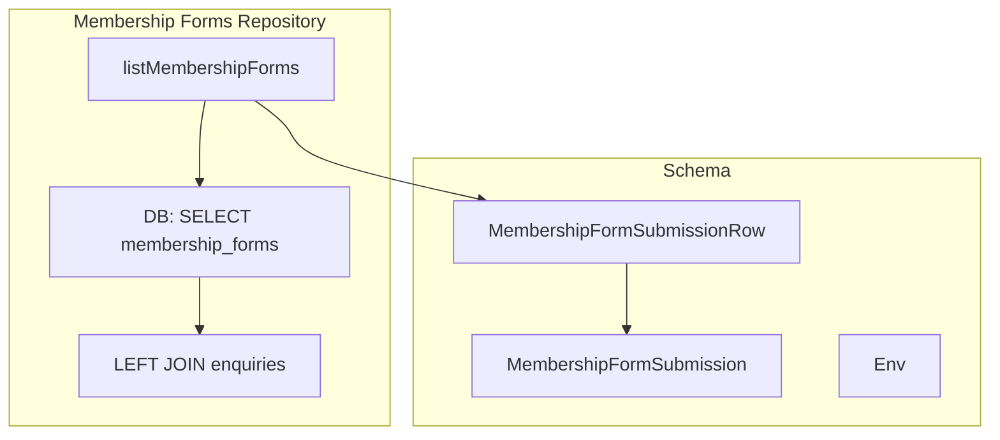

```mermaid
%% Diagram: Membership Forms Repository
graph TD
  subgraph src/lib/repositories/membership-forms.ts [Membership Forms Repository]
    ListMembershipForms[listMembershipForms] --> MembershipDB[DB: SELECT membership_forms]
    MembershipDB --> EnquiriesJoin[LEFT JOIN enquiries]
  end
  subgraph src/lib/db/schema.ts [Schema]
    MembershipFormSubmission[MembershipFormSubmission]
    MembershipFormSubmissionRow[MembershipFormSubmissionRow]
    Env[Env]
  end
  ListMembershipForms --> MembershipFormSubmissionRow
  MembershipFormSubmissionRow --> MembershipFormSubmission
```
