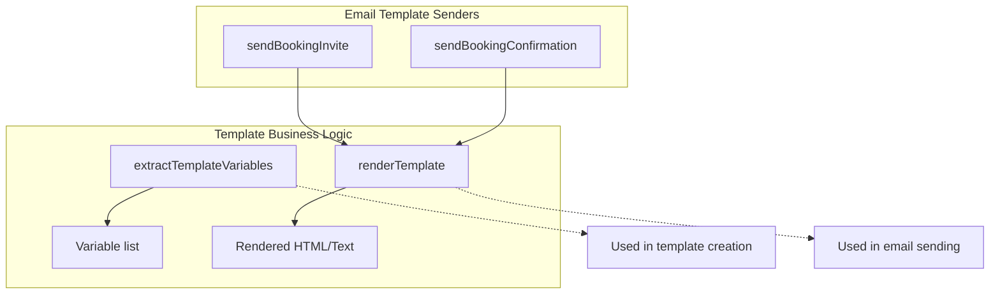

```mermaid
%% Diagram: Template Variable Extraction & Rendering
graph TD
  subgraph src/lib/business/templates.ts [Template Business Logic]
    ExtractTemplateVariables[extractTemplateVariables] --> VariableList[Variable list]
    RenderTemplate[renderTemplate] --> RenderedOutput[Rendered HTML/Text]
  end
  subgraph src/lib/email/templates.ts [Email Template Senders]
    SendBookingInvite[sendBookingInvite] --> RenderTemplate
    SendBookingConfirmation[sendBookingConfirmation] --> RenderTemplate
  end
  ExtractTemplateVariables -.-> TemplateCreation[Used in template creation]
  RenderTemplate -.-> EmailSend[Used in email sending]
```
