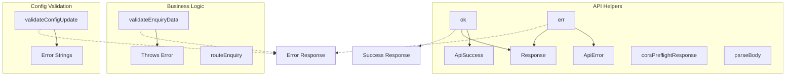

```mermaid
%% Diagram: Validation & Error Handling
graph TD
  subgraph src/api/helpers.ts [API Helpers]
    Ok[ok] --> ApiSuccess[ApiSuccess]
    Err[err] --> ApiError[ApiError]
    Ok --> Response[Response]
    Err --> Response
    CORSPreflight[corsPreflightResponse]
    ParseBody[parseBody]
  end
  subgraph src/lib/business/enquiry.ts [Business Logic]
    ValidateEnquiry[validateEnquiryData] --> ThrowsError[Throws Error]
    RouteEnquiry[routeEnquiry]
  end
  subgraph src/lib/config.ts [Config Validation]
    ValidateConfigUpdate[validateConfigUpdate] --> ErrorArray[Error Strings]
  end
  Ok -.-> SuccessFlow[Success Response]
  Err -.-> ErrorFlow[Error Response]
  ValidateEnquiry -.-> ErrorFlow
  ValidateConfigUpdate -.-> ErrorFlow
```
